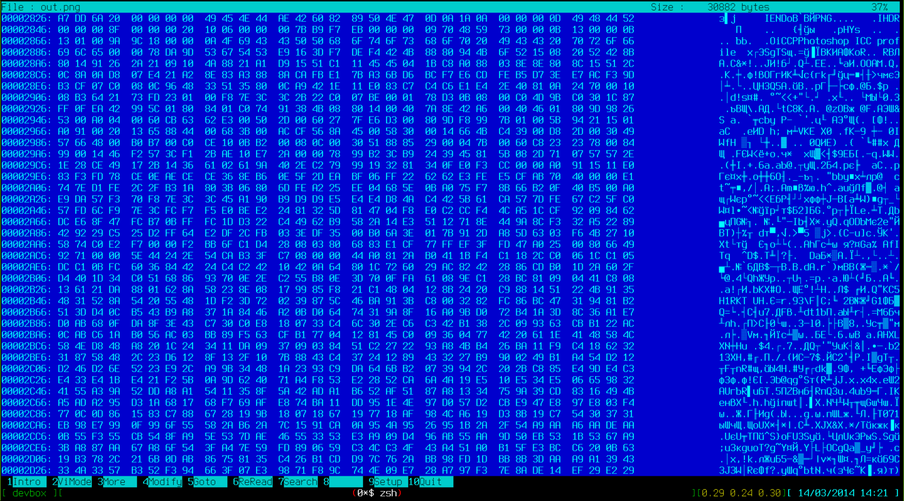

A Fix for ImageIO: Making Animated GIFs From Streaming Images
=======

Animated GIF images are widespread on the Internet, despite the fact that most modern browsers can play video on a web page with no additional software installed. GIF images have lots of drawbacks compared to video files - they're much bigger, don't support true-colors (GIF palette is limited to 256 distinct colors), can't include sound - but they're still a popular way to distribute short animations or even video clips. Even in 2014.

Animatron supports publishing an animation as a GIF file though the excellent library [Gif4J](http://www.gif4j.com/). This awesome library does a great job of optimizing frames, compression and color palettes for resulting GIF files. From my point of view, it provides the best results of GIF encoding out of all the tools available for Java in a server-side environment. Since it heavily uses various optimization tricks and tries to be abstract of the input source, it uses [BufferedImage](http://docs.oracle.com/javase/7/docs/api/java/awt/image/BufferedImage.html) as the source of image data. So, it doesn't care what you're using as source - a set of JPEG images, PNG or whatever else, even frames generated by [Java2D](http://docs.oracle.com/javase/tutorial/2d/) - as soon as you convert it to an instance of BufferedImage, Gif4J can deal with it.

Note: we love [Scala](http://www.scala-lang.org/) at Animatron. At least, some of us do, and I'm the spiritual leader of this sect. So all the following examples will be in [Scala](http://www.scala-lang.org/).

Now, everything is fine if you have set of frames. The code to create an animated GIF looks like:

    val writer = new GifImage()
    writer.setDefaultDelay(2)
    writer.setLoopNumber(0)
    val frames = ... // get a sequence of BufferedImage instances
    for (frame <- frames) {
      writer.addGifFrame(new GifFrame(frame))
    }
    GifEncoder.encode(writer,new File("animated.gif"))

So the question is - how to get a list of BufferedImages? Well, it depends. If you've got bunch of, say, PNG files - then you can use [ImageIO](http://docs.oracle.com/javase/7/docs/api/javax/imageio/package-summary.html) and its helper methods.

    val writer = new GifImage()
    writer.setDefaultDelay(2)
    writer.setLoopNumber(0)
    val frames = new File("path/to/pngs").listFiles(new FilenameFilter {
    def accept(dir: File, name: String): Boolean = name.endsWith(".png")
    }).toStream.map(ImageIO.read)
    for (frame <- frames) {
      writer.addGifFrame(new GifFrame(frame))
    }
    GifEncoder.encode(writer,new File("animated.gif"))

The frames variable would be of type Stream[BufferedImage] and we can iterate on it and feed the Gif4J with the data it needs in order to create an animated GIF image.

So far, so good. If you have a set of JPG/PNG/other image files - you can create an animated GIF out of them. But here, in Animatron, we don't have files on filesystem - instead we have to deal with a stream of PNG files, produced by [PhantomJS](http://phantomjs.org/) and written to the standard output of the PhantomJS process. At first glance, it doesn't seem to be a problem - just follow the same approach as with the set of files - but use stream as source of data to be read by ImageIO. Let's try this.

    import _root_.javax.imageio.ImageIO
    import com.gif4j.{GifEncoder, GifFrame, GifImage}
    import java.io._

    object Sample {
      def createAnimation(is: InputStream, os: OutputStream) = {
        val writer = new GifImage()
        writer.setDefaultDelay(2)
        writer.setLoopNumber(0)
        var finish = false
        var framez = 0
        while (!finish) {
            val frame = ImageIO.read(is)
            writer.addGifFrame(new GifFrame(frame))
            finish = frame != null
            framez = framez + 1
        }
        GifEncoder.encode(writer, os)
        framez
      }

      def main(args: Array[String]) {
        val os = new FileOutputStream(args(1))
        val rendered = createAnimation(new FileInputStream(args(0)), os)
        os.flush()
        os.close()
        println("Rendered framez: " + rendered)
      }

    }

As the source, we could use the [Animatron logo](http://i.imgur.com/aTjekbb.png) (save it as 1.png). Now we're going to emulate a stream from single file - just create another file with multiple copies of the logo (some shell-scripting):

    for i in 1 2 3; do cat 1.png; done >> out.png

The command above will create file "out.png" with content of 1.png, copied 3 times.

Now, let's try to read images from the file. The result on my system is:

    Rendered framez: 1

So ... only one frame is read? WTF? If you try to google the problem, you'll find posts on [StackOverflow](http://stackoverflow.com/) like [this](http://stackoverflow.com/questions/13775189/send-a-stream-of-images-using-imageio). In short - ImageIO cannot read more than one image from the stream.

I wanted to understand what was wrong, so I did some slight modification of the source code to see what was going on with the image streams inside. I'd like to say "many thanks" to the guys at Oracle, who bundled ImageIO classes into the "rt.jar" with no debugging info - that obviously added some fun to my life that I couldn't live without.

I added some "tracing" to the image generation code. I wanted to see how many bytes have been read from the stream, and what are the first 20 bytes from the remaining stream, after ImageIO finished with an image creation.

    def createAnimation(is: InputStream, os: OutputStream) = {
        val src = new CountingInputStream(is)
        val writer = new GifImage()
        writer.setDefaultDelay(2)
        writer.setLoopNumber(0)
        var finish = false
        var framez = 0
        while (!finish) {
            val frame = ImageIO.read(src)
            writer.addGifFrame(new GifFrame(frame))
            finish = frame != null
            framez = framez + 1
        }
        println("Read bytes:" + src.getByteCount.toHexString)
        val data = Array.ofDim[Byte](20)
        is.read(data)
        println(data.map(x => String.format("%1$x", java.lang.Byte.valueOf(x))).mkString(":"))
        GifEncoder.encode(writer, os)
        framez
      }

I used [CountingInputStream](http://commons.apache.org/proper/commons-io/apidocs/org/apache/commons/io/input/CountingInputStream.html) from [Commons IO](http://commons.apache.org/proper/commons-io/), which is a great collection of tools and classes that have been missing from Java core for decades. The results now are:

    Read bytes:2826
    a7:dd:6a:20:0:0:0:0:49:45:4e:44:ae:42:60:82:89:50:4e:47
    Rendered framez: 1

So 2826 bytes were read (in HEX) and 20 bytes from the remaining stream were printed.

Okay, let's look at what's going on inside the out.png. I recalled the good old [hiew](http://en.wikipedia.org/wiki/Hiew) program and found the port of it for Arch Linux. So open the file out.png, change the mode to "Hexadecimal mode" by pressing F2 and then go to to the offset 2826 (it's in HEX!) by pressing F5. You'll see something like this:

Notice that the output of our Scala program

    a7:dd:6a:20:0:0:0:0:49:45:4e:44:ae:42:60:82:89:50:4e:47

matches with the first line in the HIEW, so we seem to be on the right track. Let's look at the brief [definition](http://en.wikipedia.org/wiki/Portable_Network_Graphics#Technical_details) of PNG image format. I was especially interested in finding the boundaries of PNG file in a stream. So, according to the PNG format specification: a PNG file starts with an 8-byte signature and _IEND_ marks the image end.

So, looking back into the HIEW - the first line contains both _IEND_ block, which marks the end of the first PNG image, and beginning of next PNG image (as marked by the sequence of bytes 89:50:4e:47). This leads us to 2 important conclusions:

1. The authors of ImageIO's PNG reader didn't pay much attention to reading a PNG file from a stream correctly. So, when it's applied to reading from a stream, ImageIO leaves some parts of a PNG file in the remaining stream, and any subsequent call to ImageIO.read method on the same stream will lead to no image being read - because there's no Image header available. Worse, if by some accident a set of bytes looks like a valid image header - the remaining stream will be read completely wrong.

2. It's quite easy to fix this behavior by skipping the content of the stream until the next PNG image is found.

Keeping this in mind, the code which will correctly read a set of images from a stream and create an animated GIF may look like this:

    import _root_.javax.imageio.ImageIO
    import com.gif4j.{GifEncoder, GifFrame, GifImage}
    import java.io._
    import org.apache.commons.io.IOUtils
    import java.awt.image.BufferedImage

    object Sample {

      private def b(x: Int): Byte = x.toByte

      private final val PNGHDR = Array[Byte](b(137), b(80), b(78), b(71), b(13), b(10), b(26), b(10))

      private val MAX_IMG = 1024

      def createAnimation(is: InputStream, os: OutputStream) = {
        val data = Array.ofDim[Byte](MAX_IMG)
        val stream = new BufferedInputStream(is)
        val writer = new GifImage()
        writer.setDefaultDelay(2)
        writer.setLoopNumber(0)
        var finish = false
        var framez = 0
        while (!finish) {
          stream.mark(MAX_IMG)
          val dataRead = IOUtils.read(stream, data)
          finish = if (dataRead > 0) {
            data.sliding(PNGHDR.length, 1).toStream.take(dataRead - PNGHDR.length).zipWithIndex.dropWhile {
            case (a, _) => !a.sameElements(PNGHDR)
          }.headOption match {
            case Some((_, idx)) =>   stream.reset();   stream.skip(idx);  false
          case None =>   stream.reset();  true
         }
       } else   true
        if (!finish) {
          val imageData: BufferedImage = ImageIO.read(stream)
          finish = imageData == null
          writer.addGifFrame(new GifFrame(imageData))
          framez = framez + 1
        }
      }
      GifEncoder.encode(writer, os)
      framez
    }

      def main(args: Array[String]) {
        val os = new FileOutputStream(args(1))
        val rendered = createAnimation(new FileInputStream(args(0)), os)
         os.flush()
         os.close()
         println("Rendered framez: " + rendered)
      }
    }

The code above is pretty close to what we're using in Animatron.

The moral of the story is that sometimes you shouldn't just blindly trust code "proven by decades of usage," but rather investigate what's going on under the hood. It's also important to understand the nature and protocols of software and files. And: good old tools from the ancient times of MS-DOS are still useful in the daily lives of Java/Scala developers :)

------
*Eugene Dzhurinsky*

*Dark Lord of Serverside Orcs*
